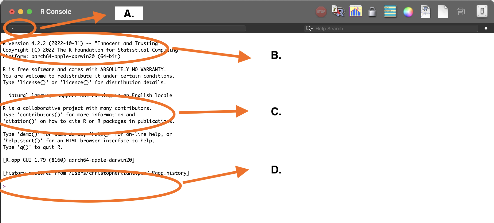

```{r setup, include=FALSE}
knitr::opts_chunk$set(echo = TRUE)


```

## APD Workshop Series: R Basics for Paleoecologists. 
\

This is meant to be a simple guide to help otherwise busy paleoecologists make use of some helpful tools for conducting research and publishing. All the while, you will also be making your work reproducible.  
\
\

### Required Software and Download Instructions
\

For this workshop we will be using two separate, but related pieces of open-source software: R and R Studio.  
\
R is a standalone open-source software for statistical analysis. It has an interesting history (you can find more here), but it is *both* a programming language and an environment within which you can use the language to execute commands. Thus, it is described as the "R Statistical Computing Environment". R is an instantiation of a tiny universe with many rules, few (or none!) of which you know.  
\
R Studio is a wrapper for R that allows us to see a bit more of what is going on inside of R and to control it through the window rather than exclusively through the "console". R Studio knows the rules so you don't have to. Much like a spell-checker in word processing, R Studio checks your code for you. More on this later.  
\
\

#### Installing R Statistical Computing Environment
\

**First**, you need to install R from [cran.r-project.org](https://cran.r-project.org/). Click this link or the logo below, at the top of the page you will find a section titled "Download and Install R" and choose the appropriate download for your operating system (OS). 
\

[{width=25%}](https://cran.r-project.org/)

\
It should look something like this:

```{r screenshot of R main site, echo=FALSE, fig.align= 'center', fig.cap= "**Figure 1**. cran.R-project website landing page."}

knitr::include_graphics("images/cran_page.jpg")

```
\


Once you've selected the R version for your OS, you'll be given some download options. Select "base" and download the .exe file (Windows).

```{r screenshot of download options, echo = FALSE, fig.align = 'center', fig.cap = "**Figure 2.** cran.R-project windows download options, select 'base'."}

knitr::include_graphics("images/cran_download.png")

```
\

Double-click on this file and follow the instructions from your machine's prompts for installation. This differs slightly between each operating system and the version of the operating system you're using.

If you're using macOS, you will be directed to a slightly different looking page with multiple download options. Here, you much choose a package based on the version of the macOS you're using. If you're using OS 11 or greater (Apple names their updates, so this one is 'Big Sur') select the top option. If you're using versions before this ('High Sierra'), then download the second option.

```{r screenshot of macOS DL options, echo = FALSE, fig.align = 'center', fig.cap = "**Figure 3.** cran.R-project macOS download options"}


```
\

For windows users, R will install to your "program files" folder. For macOS users, you will need to move the R.app folder from the package (once opened) and drag it into your applications folder. 
\
\

#### Introduction to R Syntax, Objects, and Functions

**Second**, let's open up R to make sure that it works and to look at some important features that will help you later on. When you open R, you only get a text window called the console. This is where all of the action happens and as soon as you open R, you're given some basic, but important information.

```{r screenshot of R console running solo, echo=FALSE, fig.align = 'center', fig.cap = "**Figure 4.** R Console with annotations for working directory, version, and citation instructions."}



```
\

Note the following:
-the *working directory* is the folder where R looks when it goes to find or write things.
-the software version is at the top of the initialization text, this information is important for citations.
-the intialization text includes instructions for getting information about licensing, help, and for citing R.
-the *command line* is the line starting with ">", which is where you politely ask R to do things for you.


We can actually try out a bit of coding at this point. Type the code below in your R console and hit "enter". You can also copy-paste from this document into the console as well. 

```{r console step 1, echo = TRUE, eval = FALSE}

citation()

```
\

This can also be written as:

```{r console step 2, echo = TRUE, eval = FALSE}

citation("base")

```
\

Both these commands give us the same result.

```{r console step 3, echo = FALSE}

citation()

```
\

**Congratulations!** If this is your first time using R, then you just ran your first *function*!

Note that "base" gives us the same output because the R Statistical Computing Environment comes with a lot of basic functions (hence "base") that it can do. Later, we will explore how we can expand R with "packages" written and maintained by other users.

We have accumulated some vocabulary at this point and it is helpful to explain these terms and how they relate to each other here. R will do exactly what you tell it to, so it helps to know how it thinks. The R environment runs almost entirely by creating *objects* and applying *functions* to them. Like we experienced above, *functions* make things happen. In order for R to do things with an object, it has to know that it exists. 

We could use "base" above because the citation() is already a part of R and knows where to find it (its always an object). Let's learn how to create an object. 

All coding languages run on *syntax* (rules for combining things for communication). Here's some key symbols in R syntax.
\
\

|Syntax|Action|
|-------:|-------:|
|=| equals sign is used to assign data to objects|
|<-| arrow-dash is the same as equals sign, assigns data to objects|
|#| hashes designate non-coding regions, used to annotate code|

You can copy-paste the entire section of code below and run it. Another nice thing about R is that you can submit a whole list of commands at once, as long as each of these commands and function are entered correctly. Because my annotations are preceded by a hash "#", they're not read as commands. As for whether one should use "=" or "<-", there are trade-offs to either choice. I use "=" becauese it requires typing fewer characters. 

```{r vocabulary table, echo=TRUE}

# Here, we use "=" to create an object called "x" and assign it the value of 5.

x = 5

# We can also use "<-" to create another object called "y" and assign it the value of 6.

y <- 6

```
\

Once you run the above code, you may notice that basically nothing happened. R happily ran your commands and creates an object named "x" with a value of 5 and an object "y" with a value of 6. You didn't tell R to give you any output, so none is given. Type "x" in the command line and then hit "enter". Do the same for "y". R should return the values each time after you hit "enter". This is rudimentary, but you are *coding* now. Also, now that we've experienced what R is like, we can gain a better appreciation for what R Studio does for us.

\
\

#### Installing R Studio

**Third**, you will need to [download R Studio](https://posit.co/download/rstudio-desktop/) and install it. R Studio is available as a "free version" and a "professional" version. The links here go directly to the free version. 

[{width=25%}](https://posit.co/downloads/)

The webpage should detect what sort of OS you're using and suggest the correct version of R Studio. If it does not, there are other download options below which correspond to various OS and OS versions. You will notice that the webpage also tells you to install R (which we've already done), so you can skip to "2" and download R Studio.

```{r sceenshot of R Studio Download page, echo = FALSE, fig.align = 'center', fig.cap= "**Figure 5.** R Studio Download Page."}


```
\
\

You'll get either a .exe or a .pkg file when you download R Studio (depending on OS) and you can then run this file and follow the prompts from the installation wizard. Windows users will find R Studio in their program files while masOS users will have to move the R Studio app into the Applications folder. Make a shortcut to your desktop (Windows) or put the app in your taskbar (macOS) for easy access.

Now, let's open R Studio and take a look at it. Double-click on the icon.

```{r screenshot of blank R Studio, echo=FALSE, fig.align = 'center', fig.cap= "**Figure 6.** R Studio window."}

```
\
\

You should have three panes open in the window, as shown in Fig 6. above. The leftmost should look familiar. It is the R console! This is where you'll enter commands to make R do things. It also shows you some of the same information, such as the location of the working directory. If you look carefully, this pane has two tabs: "Console" and "Jobs". Stick with the console for now, but this area of the window is dedicated to what R is *doing*.  

On the right, the top pane also has tabs: "Environment", "History", "Connections", "Git", and "Tutorial". We will rely on "Environment" and "History" more than the others for this tutorial. The "Environment" allows us to see inside R's brain. Let's take a quick look at how this works by entering the same commands from our first use of base R. You can type these commands manually or copy paste them. 

```{r simple objects in R Studio, echo = TRUE}

x = 5
y = 6

```
\

After you've run both commands (after hitting "enter"), you should see the environment update to include the new objects you've made. Base R didn't show you anything, but we demonstrated that R remembered these objects and recalled their values. Here, we can see what R knows.
\

```{r screenshot of Rstudio step 1, echo = FALSE, fig.align = 'center', fig.cap = "**Figure 7.** R Studio showing updated Environment pane after creating objects."}

knitr::include_graphics("images/Rst_env.png")

```
\
\

The bottom-right pane has several file-navigation related tabs: "Files", "Plots", "Packages", "Help", and "Viewer". We will make the most use of "Files", "Plots", and "Help" during the workshop. It defaults to "Files" when we open R Studio. It will show you the contents of the working directory as well as the file path to the working directory (below the options - "New Folder", "Delete", "Rename", "More"). This can be really helpful when troubleshooting your code. Remember, R has to be able to find your data. In order to help it do so, you have to know where R thinks it is. R always thinks it is in the working directory and this pane (plus the top of the Console) will help you figure out where R thinks that working directory is.  

Another helpful pane in the bottom-right is the plots pane. R Studio saves all of the plots that you make here. Because we've already defined two objects, let's plot them and see what happens.

```{r plotting x and y objects, echo = TRUE, eval = FALSE}

plot(x, y)

```
\
\

This should create a plot in this pane, looking something like this.

```{r plotting results screenshot, echo = FALSE, fig.align = 'center', fig.cap = "**Figure 8.** R Studio window showing plot of values of x and y."}

knitr::include_graphics("images/Rst_plt.png")

```
\
\

**Excellent!** You've already run your first function, defined objects, and then plotted them. This is basically all that R does, but we can create objects with multiple dimensions (vectors, matrices, arrays!) and run complicated functions to evaluate, synthesize, and plot this information.


