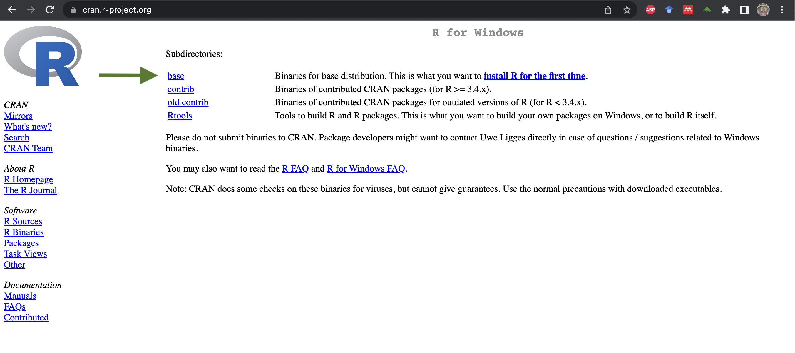

```{r setup, include=FALSE}
knitr::opts_chunk$set(echo = TRUE)


```

## APD Workshop Series: R Basics for Paleoecologists

This is meant to be a simple guide to help otherwise busy paleoecologists make use of some helpful tools for conducting research and publishing. All the while, you will also be making your work reproducible.

### Required Software

For this workshop we will be using two separate, but related pieces of open-source software: R and R Studio. R is a standalone open-source software package for statistical analysis. It is both a programming language and an environment within which you can use the language to execute commands. R is an instantiation of a tiny universe with rules, many of which you do not know. R Studio is a wrapper for R that allows us to see a bit more of what is going on inside of R and to control it through the window rather than exclusively through the "console". 


**First**, you need to install R from [cran.r-project.org](https://cran.r-project.org/). Click this link or the logo below, at the top of the page you will find a section titled "Download and Install R" and choose the appropriate download for your operating system (OS). 

[{width=25%}](https://cran.r-project.org/)

It should look something like this:

```{r screenshot of R main site, echo=FALSE, fig.align= 'center', fig.cap= "**Figure 1**. cran.R-project website landing page."}

knitr::include_graphics("images/cran_page.jpg")

```


Once you've selected the R version for your OS, you'll be given some download options. Select "base" and download the .exe file (Windows) or .pkg file (macOS).

```{r screenshot of download options, echo = FALSE, fig.align = 'center', fig.cap = "**Figure 2.** cran.R-project website download options, select 'base'."}



```

Double-click on this file and follow the instructions from your machine's prompts for installation. This differs slightly between each operating system and the version of the operating system you're using.

For windows users, R will install to your "program files" folder. For macOS users, you will need to move the R.app folder from the package (once opened) and drag it into your applications folder. 

**Second**, let's open up R to make sure that it works and to look at some important features that will help you later on.

**Third**, you will need to [download R Studio](https://posit.co/downloads/) and install it.

[{width=25%}](https://posit.co/downloads/)

## Including Plots

You can also embed plots, for example:

```{r pressure, echo=FALSE}
plot(pressure)
```

Note that the `echo = FALSE` parameter was added to the code chunk to prevent printing of the R code that generated the plot.
